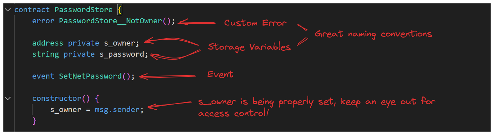
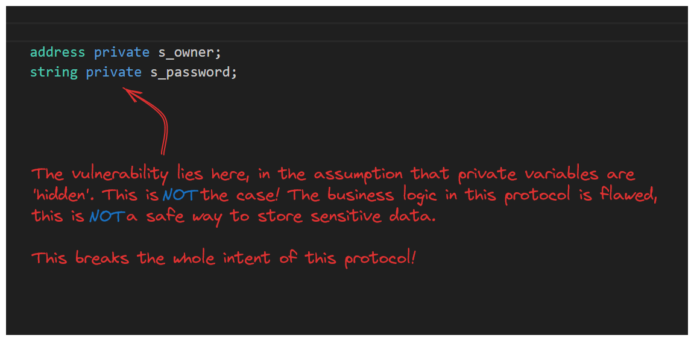
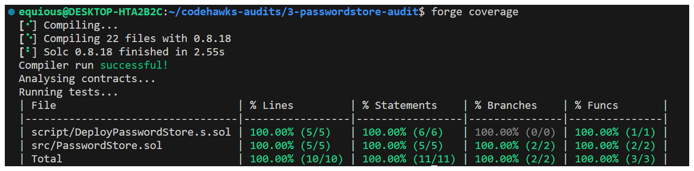
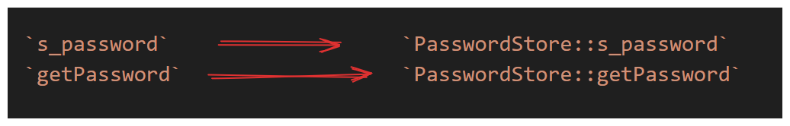
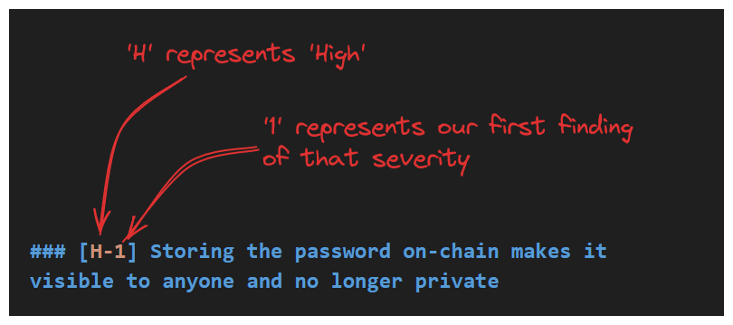

# Security Review & First Audit

### Remember the Phases

It’s important to remember the phases for each audit or security review. They include:

1. Initial Review

   * Scoping

   * Reconnaissance

   * Vulnerability Detection

   * Reporting

2. Protocol Fixes

   * Fixes issues

   * retests and adds tests

3. Mitigation Review

   * Reconnaissance

   * Vulnerability Detection

   * Reporting

For this whole, our main focus will primarily be on how to perform your initial review.

## Phase 1: Scoping 

The scoping phase is the point we initially receive a codebase for review and we perform a high level assessment.

Imagine a scenario like this:

CLIENT: *"Hi, we're the PasswordStore dev team looking to get our codebase audited ASAP to get it listed officially."*

AUDITOR: *"Hi PasswordStore, I'm beginner-auditor. Really excited to help. Could you send your codebase to me?"*

CLIENT: "Sure, here's the etherscan link to our codebase." [PasswordStore CodeV1](https://sepolia.etherscan.io/address/0x2ecf6ad327776bf966893c96efb24c9747f6694b)

This exchange is all too common, and it's horrible. It's your responsibility as a security researcher to not audit codebases provided to you in this way.

Why?

As security researchers, you're looking for more than bugs. You're looking for code maturity. If all you have is a codebase on etherscan, if there's no test suite, if there's no deployment suite you should be asking: `how mature is this code?`

```note
Remember: Secure protocols not only safeguard the code but also our reputation as researchers. They will likely blame us for a security breach if we've audited a compromised codebase.
```

If all they provide is an etherscan link, can you assure the protocol's safety? In these cases, the answer is a resounding `NO`.

### Audit Readiness

One of the first things needed to be taken care when discussing preparing for an audit was the concept of `Audit Readiness` and steps protocols should take prior to requesting an audit.

You should recall the [Rekt Test](https://blog.trailofbits.com/2023/08/14/can-you-pass-the-rekt-test/) from a Part1.

How does your client's protocol stand up against these questions?

If all they've provided you is an Etherscan link - the answer is poorly.

```note
If you're offered monetary reward to audit an Etherscan-only codebase, that's a red flag. Say NO. Doing otherwise contradicts our mission to promote secure protocols.
```

Do not take clients who have not shown the same commitment to security in their codebase as you would. If you work with clients like those described above, it should be to educate them on how to write good tests and how to prepare their code for a review.

AUDITOR: *"Hi, PasswordStore. Thank you so much for this Etherscan link, this is a great start. However, do you have a test suite? We want to have every assurance that your codebase is safe and secure. Do you have a Git Repo or GitHub with a testing framework?"*

CLIENT: *"AH! Yes, Sorry. We have a Foundry Test repo set up for this, let me send you that Git codebase."*

If a protocol's response to your care in securing them isn't like they above, and they begin pressuring you - walk away. It's evidence that 
security isn't their focus.

### Getting Started
Alright! Starting off, our client has graciously updated the codebase for this security review, featuring an improved framework and enhanced verbosity in their [Security Review CodeV2](https://github.com/Cyfrin/3-passwordstore-audit).

Exploring the new codebase, we find it to be comprehensive with an src folder and a script detailing deployment procedures. However, as we dig in, we find that the README needs refinement and tailoring to our needs rather than the template Foundry README. There is also a glaring omission — there are no test folders.

In addition to this, we're not really sure what we should be focusing on in our review. It's unlikely the client wants us auditing libraries, or scripts - but these are vital things to confirm with them in the scoping phase before beginning the audit.

### Preparing for the Audit: Onboarding Questions

[Minimal Onboarding Questions](https://github.com/Cyfrin/security-and-auditing-full-course-s23/blob/main/minimal-onboarding-questions.md): This document will help you extract the minimum information necessary for a successful audit or security review.
There is also [Extensive Onboarding Questions](https://github.com/Cyfrin/security-and-auditing-full-course-s23/blob/main/extensive-onboarding-questions.md) document, to obtain more detail.

Let's go through these questions and understand why each one is important in preparing for our security review.

1. **About the Project**: Knowledge about the project and its business logic is crucial. You need to be aware of what the project is intended to do so as to spot areas where code implementation does not align with the project's purpose. Remember 80% of vulnerabilities are a product of business logic implementation!

2. **Stats**: Information about the size of the codebase, how many lines of code are in scope, and its complexity are incredibly vital. This data will help to estimate the timeline and workload for the audit.

3. **Setup**: We need to ask the protocol how to build and test the project, which frameworks they've used etc.

4. **Review Scope:** Know the exact commit hash that the client plans to deploy and the specific elements of the codebase it covers. You do not want to spend time auditing code that the client has already modified or doesn't plan to use. The protocol should include the appropriate GitHub URL and explicitly detail which contracts are in scope.

5. **Compatibilities**: Information about the solidity version the client is using, the chains they plan on working with, and the tokens they will be integrating is important, we'll go into why later.

6. **Roles**: This entails understanding the different roles and powers within the system and detailing what the different actors should and shouldn't be able to do.

7. **Known Issues**: Understanding existing vulnerabilities and bugs which are already being considered/fixed. This will allow you to focus on the hidden issues.

Asking the questions of your client is an integral part of assuring they're ready for an audit. Should a protocol give push back, this is a red flag that they aren't taking security as seriously as they should.

As security researchers you're, in a way, educators. It's your job to educate protocols on the importance of these security considerations and adequate documentation.

Once our client has provided answers to the above and provided an updated codebase ([Security Review CodeV3](https://github.com/Cyfrin/3-passwordstore-audit/tree/onboarded)) they've also filled out the [questionnaire](https://github.com/Cyfrin/3-passwordstore-audit/blob/onboarded/minimal-onboarding-filled.md) we provided them.we're finally ready to..

### Dig into the Updated Codebase

Your client should have provided you a commit hash. By navigating to the GitHub Repo's commit history, you can used the first `7 characters` of the commit hash to find the exact version of the repo to focus on. 

**Read the answer to the questionnaire provided in CodeV3**

### Local Setup

Firstly:

```note
git clone https://github.com/Cyfrin/3-passwordstore-audit
cd 3-passwordstore-audit
code .
```
Now we want to checkout the exact commit hash in our audit scope by running:

```bash 
git checkout <commithash>
```
This will switch you to a detached HEAD state of the branch we want. Basically this is a state where changes won't be saved, so let's create a branch we want to work on officially:

```bash
git switch -c passwordstore-audit
```
We can confirm the branch we're on now by running:

```bash
git branch
```

`Stats` section: This section of the documentation is comprised of a line count and complexity rating typically and you should be prepared to calculate these details for your client and use them to estimate the duration of your audit.

One of the components of the `Stats` section is `nSLOC` or `number of source lines of code`. A very simple tool exists to help us derive this count.

**_Tool Alert!_**

[CLOC](https://github.com/AlDanial/cloc) - cloc counts blank lines, comment lines, and physical lines of source code in many programming languages. It's compatible with Solidity, Python, Rust and many more.

Once successfully installed, verify your installation.

```bash
cloc --help
```

Once installed, you can run using the command `cloc <directory>`.

```bash
cloc ./src/
```

### The Importance of Knowing Your Codebase Size
Why is knowing the number of source lines of code (also referred to as nSLOC) crucial? The answer lies in the process of auditing and security research.

As you perform more audits and delve further into security research, you'll start to gauge the pace at which you can audit a code base. Understanding that pace enables you to estimate more accurately the time required for future coding or auditing tasks based on the size of the code base.

This is incredibly useful, as with time, you can use your past audit experience and tell the protocol you're working with how long it will take to audit their codebase. Notably, this pace tends to speed up as you do more security reviews. Nevertheless, it's a good starting point.

```note
"When auditing 1000 lines of code for the first time, you now have an estimated timeline for subsequent audits or security reviews of 1000 lines codebases."
```

Often, competitive audits might have a quicker timeline depending on the auditing platform. Upon having a good grasp of your auditing speed, it may assist in selecting competitive audits that align with your capabilities, or even ones that push you to accelerate your pace.

## Manual Review with an Expert

These are the key points to how one should do manual review of the code, this points are taken from a talk with Tincho. Tincho is a legend in Web3 security and is a member of [The Red Guild](https://theredguild.org/), a smart contract and EVM security firm. He was a previous lead auditor for the security firm at `OpenZeppelin`

#### 1. **Initial Setup**

* **Download code + read documentation first**
  → Understand context, jargon, intended functionality.
* Goal: Build intuition before diving into code.

#### 2. **Tools & Frameworks**

* **VS Codeium** → editor with privacy focus.
* **Foundry** → fast framework for testing + fuzzing.
* **CLOC** → count lines of code, gauge complexity.
* **Solidity Metrics (Consensys)** → analyze complexity & organization.
* Strategy: Start with smaller contracts → build up.

#### 3. **Mindset**

* Switch into **adversarial mode**:

  * “How can I break this?”
  * “Will this work for all tokens?” (e.g. USDT non-standard `transferFrom`)
  * “Is access control correct?”

#### 4. **Audit Process**

* **Iterative**: Audit → Review → Re-audit.
* **Take notes**:

  * Inline in code.
  * Separate file for raw notes/ideas.
* Avoid tunnel vision: regularly zoom out to full system view.
* Use **tests/fuzzing** to validate suspicions.

#### 5. **Communication**

* Keep **open communication** with protocol team.

  * They know intended behavior best.
  * Collaborate, but remain objective.

#### 6. **Time-Bounding**

* Auditing can be endless → **set time limits**.
* Be as thorough as possible within the bounds.

#### 7. **Audit Report**

* Deliver a **clear + concise report**:

  * List vulnerabilities.
  * Provide mitigation recommendations.
* Follow up to **verify fixes** don’t introduce new bugs.

#### 8. **On Missed Vulnerabilities**

* You won’t catch everything.
* Goal: Provide **value beyond just finding bugs** → educate, guide best practices.
* Responsibility is **shared** with the client.

#### 9. **Final Takeaway**

* Continuous learning, growth, and intuition matter most.
* "Do your best every day → experience builds skill."

---
### Phase 2: Recon

### First Step: Understanding The Codebase

Once you've finished reading through the documentation, we can proceed to...

#### Scoping Out The Files

We can organize the files of the protocol in scope and assess their respective complexity.

1. Download and install the [Solidity Metrics](https://marketplace.visualstudio.com/items?itemName=tintinweb.solidity-metrics) extension for VS Code by *tintinweb*

2. Once installed, you can right-click the appropriate folders to run the tool on and select `Solidity: Metrics` from the context menu.

```note
Pro-tip: If your repo has more than one applicable folder, you can CTRL + Click to select multiple simultaneously.
```

After generating the report, navigate to the command palette and locate 'export this metrics report'. Once exported, you'll have HTML access to the report for future reference.

Some aspects to pay attention to in this metrics report are the `Inheritance Graph`, The `Call Graph`, and The `Contracts Summary`. It's not super obvious with such a simple protocol, but these are going to provide valuable insight down the line.

### The Code 
Dont rush into finding bugs/vulnerabilities in the code, first try to understand the codebase better. In essence, understanding the functionalities and architecture of the code forms the first and most important part of code inspection.

### Understanding What the Codebase Is Supposed to Do
Our client's documentation has let us know what the intended functionality of the protocol are. Namely: A user should be able to store and retrieve their password, no one else should be able to see it.

Let's try to find this functionality within the code as we go through things line by line.

#### Scanning the Code from the Top
After gaining a fundamental understanding, you can start going through the code. You can jump directly to the main functionality. However, to keep things simple, let's just start right from the top and start working our way down.

First Lines:

```solidity
// SPDX-License-Identifier: MIT
pragma solidity 0.8.18;
```
The open source license seems fine. A compiler version of 0.8.18 may not be an immediate concern, but we do know that this isn't the most recent compiler version. It may be worthwhile to make note of this to come back to.

```solidity
// SPDX-License-Identifier: MIT
pragma solidity 0.8.18; // Q: Is this the correct compiler version?
```
Formatting our in-line comments in a reliable way will allow us to easily come back to these areas later by leveraging search.


### Moving Further

Next we see some `NatSpec` comments like this can be considered extended documentation and will tell us more about what the protocol is expected to do.

```js
/*
 * @author not-so-secure-dev
 * @title PasswordStore
 * @notice This contract allows you to store a private password that others won't be able to see.
 * You can update your password at any time.
 */
 ```
 Let's consider things upto our constructor.



Everything looks great so far, the client is using some clear standard naming conventions.

**Hypothetically**, were the naming conventions poor, we might want to make an informational note.

```solidity
contract PasswordStore {
    // I - naming convention could be more clear ie 'error PasswordStore__NotOwner();'
    error NotOwner();
}
```

In the example above we use // I for informational findings, but use what feels right for you.

### Looking at Functions
Alright, we've reached the functions of this protocol. Let's assess the `setPassword()` function first. Fortunately, we again have `NatSpec` to consider.

```solidity
/*
     * @notice This function allows only the owner to set a new password.
     * @param newPassword The new password to set.
     */
    function setPassword(string memory newPassword) external {
        s_password = newPassword;
        emit SetNetPassword();
    }
```

Sometimes a protocol won't have clear documentation like the above. This is where clear lines of communication between the security reviewer and the client are fundamental.

Were things less clear, it may be appropriate to leave a note to ask the client.

```js
// Q What's this function do?
```

It can't be stressed enough, clarity in our understanding of the codebase and the intended functionalities are a **necessary** part of performing a security review.

---

### Phase 3: Exploit/ Vulnerability Detection

### The First Vulnerability

```solidity
    /*
     * @notice This function allows only the owner to set a new password.
     * @param newPassword The new password to set.
     */
    function setPassword(string memory newPassword) external {
        s_password = newPassword;
        emit SetNetPassword();
    }
```

The function's `NatSpec` gives us a clear `invariant` - "..only the owner..". This should serve as a clue for what to look for and we should as ourselves...

*Can anyone other than the owner call this function?*

At first glance, there doesn't seem to be anything preventing this. I think we've found something! Let's be sure to make notes of our findings as we go.

```solidity
    /*
     * @notice This function allows only the owner to set a new password.
     * @param newPassword The new password to set.
     */
    // @Audit - High - any user can set a password.
    function setPassword(string memory newPassword) external {
        s_password = newPassword;
        emit SetNetPassword();
    }
```
### The Bug Explained

What we've found is a fairly common vulnerability that protocols overlook. Access Control effectively describes a situation where inadequate or inappropriate limitations have been places on a user's ability to perform certain actions.

In our simple example - only the owner of the protocol should be able to call setPassword(), but in its current implementation, this function can be called by anyone.

I'll stress again the value of taking notes throughout this process. In-line comments, formatted properly are going to make returning to these vulnerabilities later for reassessment much easier and will keep you organized as you go.

```js
// @Audit - Any user can set a password - Access Control
```
Clear and concise notes are key.

Alright, one function down, one to go. Let's take a look at what's next.

```solidity
/*
* @notice This allows only the owner to retrieve the password.
* @param newPassword The new password to set.
*/
function getPassword() external view returns (string memory) {
    if (msg.sender != s_owner) {
    revert PasswordStore__NotOwner();
    }
    return s_password;
}
```
Starting, starting as always with the NatSpec documentation, we see a couple things to note:

* Only the owner should be able to retrieve the password (your access control bells should be ringing)

* The function should take the parameter newPassword.

We see a problem on the very next line. This function doesn't take a parameter. Certainly informational, but let's make a note of it.

```js
/*
* @notice This allows only the owner to retrieve the password.
// @Audit - parameter not used by function, NatSpec can be removed
* @param newPassword The new password to set.
*/
```


The function looks great! Adhering to the required access control, we can be sure only the owner can call this function.

There's another issue hidden in this contract

`State Variables`



We've uncovered a major flaw in the business logic of this protocol. It's best we make a note of this.

```js
address private s_owner;
// @Audit - s_password variable is not actually private! Everything on the blockchain is public, this is not a safe place to store your password.
string private s_password;
```
---

As security researchers our job is to ultimately do what's necessary to make a protocol more secure. While we've thoroughly examined everything within scope of `PasswordStore` there can be some value in expanding our recon.

Test suites should be an expectation of any protocol serious about security, assuring adequate test coverage will be valuable in a `private audit`.

To check `coverage`

```bash
forge coverage
```



Wow! test coverage looks great...right? It's important to note that coverage may be a vanity metric and not truly representative of what's being tested for. If we look closely at the tests included, we can see the a major vulnerability we found (`Access Control`) wasn't tested for at all.

```solidity
function test_owner_can_set_password() public {
    vm.startPrank(owner);
    string memory expectedPassword = "myNewPassword";
    passwordStore.setPassword(expectedPassword);
    string memory actualPassword = passwordStore.getPassword();
    assertEq(actualPassword, expectedPassword);
}
​
function test_non_owner_reading_password_reverts() public {
    vm.startPrank(address(1));
​
    vm.expectRevert(PasswordStore.PasswordStore__NotOwner.selector);
    passwordStore.getPassword();
}
```
In addition to the above, tests aren't going to catch problems with documentation, or erroneous business logic. It's important not to assume things are fine because our framework tells us so.

---

### Phase 4: Reporting

After the identification phase, we are tasked with communicating our findings to the protocol. This phase is crucial on several levels:

1. We need to convince the protocol that the identified vulnerabilities are valid.

2. We must illustrate how severe/impactful the issue is

3. We should also help the protocol with mitigation strategies.

By effectively communicating this information, we position ourselves as educators, helping the protocol understand why these vulnerabilities are issues, why they were overlooked, and how to fix them to avoid running into the same issues in the future.

#### Writing Your First Finding

Now comes an incredibly exciting part - doing a minimalistic write up of the vulnerabilities you've found.

A simple template you can use: [Template](https://github.com/Cyfrin/security-and-auditing-full-course-s23/blob/main/finding_layout.md)

Open a new file in your project, titled` audit-data`, download and copy `finding_layout.md` into this folder.

You can customize this layout however you like, but this minimalistic template is a great starting point.

```note
The report so far:
[S-#] TITLE (Root Cause + Impact)
Description:

Impact:

Proof of Concept:

Recommended Mitigation:
```

#### Title

The first thing we need to fill out is our report's title. We want to be concise while still communicating important details of the vulnerability. A good rule of thumb is that your title should include:

```note
Root Cause + Impact
```

So, we ask ourselves *what is the root cause of this finding, and what impact does it have?*

For this finding the root cause would be something asking to:

* **Storage variables on-chain are publicly visible**

and the impact would be:

* **anyone can view the stored password**

Let's work this into an appropriate title for our finding

```note
### [S-#] Storing the password on-chain makes it visible to anyone and no longer private
​
**Description:**
​
**Impact:**
​
**Proof of Concept:**
​
**Recommended Mitigation:**

```

Alright, title done. What's next? Let's take a look at description and impact.

#### Description

Our goal here is to describe the vulnerability concisely while clearly illustrating the problem. A description for our finding here might look like this.

```note 

**Description:** All data stored on chain is public and visible to anyone. The s_password variable is intended to be hidden and only accessible by the owner through the getPassword function.
```

This looks good, but we can do even better. The bigger a codebase, the more our variables and references are going to get lost. We can fight this with a little bit of markdown formatting and standardizing our naming conventions.



Consider the above adjustments to our references in the description. By wrapping the variable and function name in backticks we're able to highlight them. Additionally we're prepended the names with reference to the contract in which they're found.

```note
**Description:** All data stored on chain is public and visible to anyone. The `PasswordStore::s_password` variable is intended to be hidden and only accessible by the owner through the `PasswordStore::getPassword` function.
```

This is the kind of clarity we should strive for in our reports!

#### Impact
This is the kind of clarity we should strive for in our reports!

```note
**Impact:** Anyone is able to read the private password, severely breaking the functionality of the protocol.
```
#### Proof of Code/Concept

how we programmatically prove the claim we're making - that anyone can read the protocol's stored password.

First we need a local chain running.

```bash
anvil
```
>**_NOTE:_** Most PoC's won't require a local blockchain

Next we need to deploy our protocol, fortunately, PasswordStore has a `make` command set up for us. Note that their deploy script is setting the password `myPassword` in the process. Open a new terminal and run the following.

```bash
make deploy
```

Foundry allows us to check the storage of a deployed contract with a very simple `cast` command. For this we'll need to recall to which storage slot the `s_password` variable is assigned.


With this consideration we can run the command `cast storage <address> <storageSlot>` like this (your address may be different).

```bash
cast storage 0x5FbDB2315678afecb367f032d93F642f64180aa3 1
```

We should receive an output similar to this:

```bash
`0x6d7950617373776f726400000000000000000000000000000000000000000014`
```

This is the bytes form of the data at storage slot 1. By using another convenient Foundry command we can now decode this data.

```bash
cast parse-bytes32-string 0x6d7950617373776f726400000000000000000000000000000000000000000014
```
Our output then becomes:

```note
myPassword
```

```note
**Proof of Concept:**The below test case shows how anyone could read the password directly from the blockchain. We use foundry's cast tool to read directly from the storage of the contract, without being the owner.

Create a locally running chain

bash: `make anvil`

Deploy the contract to the chain
bash: `make deploy`

Run the storage tool

We use 1 because that's the storage slot of s_password in the contract.

bash: `cast storage <ADDRESS_HERE> 1 --rpc-url http://127.0.0.1:8545`

You'll get an output that looks like this:

bash: `0x6d7950617373776f726400000000000000000000000000000000000000000014`

You can then parse that hex to a string with:

bash: `cast parse-bytes32-string 0x6d7950617373776f726400000000000000000000000000000000000000000014`

And get an output of:

bash: `myPassword`

```

#### Recommended Mitigation
This finding in `PasswordStore` kinda leaves us in a tough spot. We can't just suggest an adjustment to the code to fix things - the problem is fundamentally tied to the goals/architecture of the protocol. A recommendation in a situation like this might look like:

```note

**Recommended Mitigation:** Due to this, the overall architecture of the contract should be rethought. One could encrypt the password off-chain, and then store the encrypted password on-chain. This would require the user to remember another password off-chain to decrypt the stored password. However, you're also likely want to remove the view function as you wouldn't want the user to accidentally send a transaction with this decryption key.

```

Here's our report now:

<details>

<summary>Report</summary>

### \[S-#] Storing the Password On-Chain Makes It Visible to Anyone and No Longer Private

**Description:**
All data stored on-chain is public and visible to anyone. The `PasswordStore::s_password` variable is intended to be hidden and only accessible by the owner through the `PasswordStore::getPassword` function.

One such method of reading any data off-chain is shown below.

**Impact:**
Anyone is able to read the private password, severely breaking the functionality of the protocol.

**Proof of Concept:**
The below test case shows how anyone could read the password directly from the blockchain. We use Foundry's `cast` tool to read directly from the storage of the contract, without being the owner.

Steps:

1. Create a locally running chain:

   ```bash
   make anvil
   ```

2. Deploy the contract to the chain:

   ```bash
   make deploy
   ```

3. Run the storage tool:

   ```bash
   cast storage <ADDRESS_HERE> 1 --rpc-url http://127.0.0.1:8545
   ```

   We use `1` because that's the storage slot of `PasswordStore::s_password`.

You’ll get an output that looks like this:

```
0x6d7950617373776f726400000000000000000000000000000000000000000014
```

You can then parse that hex to a string with:

```bash
cast parse-bytes32-string 0x6d7950617373776f726400000000000000000000000000000000000000000014
```

And get an output of:

```
myPassword
```

**Recommended Mitigation:**
Due to this, the overall architecture of the contract should be rethought. One could encrypt the password off-chain, and then store the encrypted password on-chain. This would require the user to remember another password off-chain to decrypt the stored password.

Additionally, it is recommended to remove the view function as the user might accidentally send a transaction with the decryption key.

</details>

#### Next Finding

let's add a clean template to our `findings.md` for our `Access Control` finding and start filling this out together.

A reminder of the function in question and our empty template:

```solidity
/*
     * @notice This function allows only the owner to set a new password.
     * @param newPassword The new password to set.
     */
    function setPassword(string memory newPassword) external {
        s_password = newPassword;
        emit SetNetPassword();
    }

```

#### Title

`Root Cause + Impact`

* **Root Cause**: setPassword has no access control

* **Impact**: non-owner can change the password.

```note
[S-#] `PasswordStore::setPassword` has no access controls, meaning a non-owner could change the password
```

#### Description

```note
Description: The `PasswordStore::setPassword` function is set to be an `external` function, however the purpose of the smart contract and function's natspec indicate that `This function allows only the owner to set a new password`.
```

#### Impact

```note
**Impact:** Anyone can set/change the stored password, severely breaking the contract's intended functionality
```

#### Proof of Concept/Proof of Code

Let's write a fuzz test to check if in fact addresses other than the owner are able to call setPassword.

```solidity
    function test_anyone_can_set_password(address randomAddress) public {
        vm.assume(randomAddress != owner);
        vm.startPrank(randomAddress);
        string memory expectedPassword = "myNewPassword";
        passwordStore.setPassword(expectedPassword);
​
        vm.startPrank(owner);
        string memory actualPassword = passwordStore.getPassword();
        assertEq(actualPassword, expectedPassword);
    }
```

Foundry will pass this function random addresses to see if the assert holds, based on the number of runs we've configured.

#### Recommended Mitigations

```note
add access control to this function.
```

#### Final Finding
Our last finding is informational in nature, it's not very impactful, but it's still an issue and we should report it.

#### Title

`Root Cause + Impact`

* **Root Cause** - NatSpec describes a parameter that doesn't exist

* **Impact** - NatSpec is incorrect

```note

**Title:** [S-#] The `PasswordStore::getPassword` natspec indicates a parameter that doesn't exist, causing the natspec to be incorrect.
s
```
#### Description

```note
**Description:**
'''
/*
 * @notice This allows only the owner to retrieve the password.
@> * @param newPassword The new password to set.
 */
function getPassword() external view returns (string memory) {}
'''

The `PasswordStore::getPassword` function signature is `getPassword()` while the natspec says it should be `getPassword(string)`.
```

#### Impact

```note
**Impact** The natspec is incorrect
```

#### Proof of Concept

This section isn't actually needed for a report like this, so we'll omit it.

#### Recommended Mitigation
This one should be obvious to us as well. We recommend the documentation is made accurate. Let's add it to the report.

```note
**Recommended Mitigation:** Remove the incorrect natspec line
```

We can use a fun markdown trick to illustrate the suggested changes.

```note

```diff
+ line you want to add (shown in green)
- line you want to remove (shown in red)
```

This will look like:

```diff
+ line you want to add (shown in green)
- line you want to remove (shown in red)
```

Now put everything altogether:

<details>
<summary>Writeup</summary>
[S-#] The `PasswordStore::getPassword` natspec indicates a parameter that doesn't exist, causing the natspec to be incorrect.
​
**Description:**
    '''
    /*
     * @notice This allows only the owner to retrieve the password.
    @> * @param newPassword The new password to set.
     */
    function getPassword() external view returns (string memory) {}
    '''
​
    The `PasswordStore::getPassword` function signature is `getPassword()` while the natspec says it should be `getPassword(string)`.
​
**Impact:** The natspec is incorrect
​
**Recommended Mitigation:** Remove the incorrect natspec line.
​
'''diff
    /*
     * @notice This allows only the owner to retrieve the password.
-     * @param newPassword The new password to set.
     */
'''
</details>

---

### How to Evaluate a Finding's Severity

* **Reference**: [CodeHawks Documentation](https://docs.codehawks.com/hawks-auditors/how-to-evaluate-a-finding-severity)

Severities include `High`, `Medium` and `Low`. Some security researchers will include a `Critical` severity.

#### Impact: High, Medium, and Low

Determining the category comes down to two elements: the likelihood of an attack and the impact of the attack. Though these can be subjective, there are some standard guidelines.

1. **High Impact**: `funds` are directly or nearly `directly at risk`, or a `severe disruption` of protocol functionality or availability occurs.

2. **Medium Impact**: `funds` are `indirectly at risk` or there’s `some level of disruption` to the protocol’s functionality.

3. **Low Impact**: `Fund are not at risk`, but a function might be incorrect, or a state handled improperly etc.

Think of it in terms of user experience - *how pissed off would users be if an attack happened?*

#### Likelihood: High, Medium, and Low

Assessing the likelihood of a certain event happening can be somewhat subjective. That said, consider the following:

1. **High Likelihood**: Highly probably to happen.

   * a hacker can call a function directly and extract money

2. **Medium Likelihood**: Might occur under specific conditions.

   * a peculiar ERC20 token is used on the platform.

3. **Low Likelihood**: Unlikely to occur.

   * a hard-to-change variable is set to a unique value at a specific time.

```note
Note: Some situations are so unlikely they're considered `computationally unfeasible` and are not considered valid attack paths.
```

### Assigning Severities

```solidity
### [S-#] Storing the password on-chain makes it visible to anyone and no longer private
​
### [S-#] `PasswordStore::setPassword` has no access controls, meaning a non-owner could change the password
​
### [S-#] The 'PasswordStore::getPassword` natspec indicates a parameter that doesn't exist, causing the natspec to be incorrect
```

#### Finding #1

**[S-#] Storing the password on-chain makes it visible to anyone and no longer private**

Upon consideration we see that, while funds aren't at risk, the user's 'hidden' password being visible to anyone is a pretty severe impact to how the protocol is expected to function.

Here, assessment of `Impact` should be `High`.

Now, for likelihood we ask ourselves:

* `How likely is it that somebody will be able to exploit this?`

The answer is - very likely. There's nothing stopping any malicious actor from acquiring the stored password - it's almost a certainty. `Likelihood` should also be considered `High`.

**Likelihood & Impact:**

* Impact: High

* Likelihood: High

* Severity: High

Applying our assessment to our finding title should look like this:



>**_Pro-tip_**: We should try to arrange our findings in our report from High -> Low and from Worst -> Least Offenders

#### Finding #2

**[S-#] PasswordStore::setPassword has no access controls, meaning a non-owner could change the password**

Considering our second finding, we can tell that anyone being able to set the password at any time is a severe disruption of protocol functionality. A clear `High Impact`.

The `likelihood` is also going to be `High`. Anyone can do this, at any time, the vulnerability is rooted in `access control`.

**Likelihood & Impact:**
* Impact: High

* Likelihood: High

* Severity: High

#### Finding #3

**[S-#] The 'PasswordStore::getPassword` natspec indicates a parameter that doesn't exist, causing the natspec to be incorrect**

Just like before, let's ask ourselves things like

* `Are funds at risk?` - No.

* `Is this a severe disruption of the protocol?` - No.

* `Are funds indirectly at risk?` - No

* `Is there SOME disruption of the protocol?` - Also no.

It seems already that this finding is going to be pretty low severity, but look at our `Low Impact` criteria, we can see that even this doesn't seem to apply.

What do we do?

#### Likelihood & Impact
* Impact: NONE

* Likelihood: HIGH

* Severity: Informational/Gas/Non-crit

In cases like these we would want to inform the protocol that these considerations may not explicitly be bugs but they could include things like

* Design Pattern Improvements

* Test Coverage Improvements
 
* Documentation Errors

* Spelling Mistakes

Anything that isn't a bug, but maybe should be considered anyway to make the code more readable etc - `Informational Severity` (sometimes called 'non-crits') There are also `Gas` severity findings, pertaining to gas optimizations.

This is how our titles look now:

```note
### [H-1] Storing the password on-chain makes it visible to anyone and no longer private
​
### [H-2] `PasswordStore::setPassword` has no access controls, meaning a non-owner could change the password
​
### [I-1] The 'PasswordStore::getPassword` natspec indicates a parameter that doesn't exist, causing the natspec to be incorrect
```

### Are we done?

Now, this is a lot. You're probably wondering if we should go back and look at the code again. Maybe we missed something...

Take a moment to consider what you would do in a `live audit` situation. Consider your answer before continuing on.

<details>
<summary>The Answer</summary>
Maybe.
Honestly, we can always look at one more line of code. We can always further scrutinize a repo. At some point however, we have to say "I'm done."

A lot of time's we're going to be time-boxed in what we do. There will be a limit to the amount of time we can reasonably spend on something. Sometimes this time-boxing is a hard limit we impose on ourselves to assure we remain at our most efficient.

Often a pressing situation comes down to time management and setting bounds on the time we spend on things.
</details>

---

### First Professional Markdown Report

Convert a list of findings into a professional-looking PDF using *Markdown*.

**Resources:**
1. [Github repo](https://github.com/Cyfrin/audit-report-templating) assisting security reviewers with generating these reports.

2. [Pandoc](https://pandoc.org/installing.html) - a universal document converter that we'll be leveraging to generate our PDFs

3. [LaTeX](https://www.latex-project.org/get/) - a document preparation system for typesetting used in technical and scientific documentation primarily.

4. [Markdown All in One](https://marketplace.visualstudio.com/items?itemName=yzhang.markdown-all-in-one) - Amazing VS Code extension to get the most our of markdown formatting.

5. [VSCode PDF](https://marketplace.visualstudio.com/items?itemName=tomoki1207.pdf) - will allow us to preview PDF files within VSCode

#### Adding LaTex to Pandoc

Once `Pandoc` has been installed, it should create a folder in your root directory named `.Pandoc`, within is a `templates` folder. We want to navigate there.

In our provided GitHub Repo, you'll find a specific template file named [eisvogel.latex](https://github.com/Cyfrin/audit-report-templating/blob/main/eisvogel.latex). You want to copy this file into your `templates` folder.

```note
This eisvogel.latex template is what's going to tell Pandoc how to format our PDF for us! Challenge yourself to customize this template in future!
```

#### Setting Up
Once `Pandoc` and `LaTex` have been installed, create a file named `report.md` in your audit-data folder.

Within the aforementioned GitHub Repo, you'll find `report-example.md`. Copy this into your newly created file. This will be our template for building our final report.

#### Adding Your Own Logo

Lastly, let's add a bit of flare. Find an awesome logo (pdf format) and add it to the audit-data folder as well. Name this file `logo.pdf`.

#### Filling out report.md
Inside our `report.md` template, we're going to want to personalize a number of things.

* **Title:** Name it something that describes your work precisely such as "Network Vulnerability Assessment".

* **Author**: You!

* **Date:**Update the audit date.

Now, let's move to the sections under `===` which you can customize according to your audit:

* **Prepared** by: You!

* **Auditors**: You again! If you're working as part of a team, you can list contributors here.

* **Protocol summary**: Describe the protocol and its workings.

* **Disclaimer**: Enter your name in the space provided, this is to assure the protocol knows that the report is not a guarantee of bug-free code.

* **Risk classifications**: Explain the criteria for classifying severities into High, Medium and low.

* **Audit details:** Include the commit hash that your findings correspond to.

* **Scope**: Include reference to the exact contracts the review has covered.

   * Note: the `└──` , found in the README scope will error when we generate the PDF. Replace this with `#--`.

* **Audit roles**: The roles of the protocol, these were some of the earliest notes we took!

* **Executive summary**: Give a brief overview of the assessment process.

* **Severity and number of issues found**: Summarize the number and severity of issues detailed in the report.

* **Findings**: This is our breakdown of specific findings uncovered over the course of the audit. Paste the write-ups we've done into the respective severity categories and delete the ones we don't need!

Our report is now ready to be transformed into a professional looking PDF!

#### Generating the PDF
Alright, moment of truth. In your terminal, navigate to your audit-data folder. Assuming everything has gone well upto now we should just have to run the command:

```bash
pandoc report.md -o report.pdf --from markdown --template=eisvogel --listings
```
`report.pdf` will be created in your folder.

---

## Summary

## Onboarding

Importance of thoroughly onboarding a protocol. Often we'll receive audit requests without context or preparation (i.e. random Etherscan links) and it's our job to advise the protocol that these are inappropriate. We should educate them on steps required to be ready for an audit.

Think back to our [minimal-onboarding-questions](https://github.com/Steiner-254/PasswordStore-Audit/blob/main/minimal-onboarding-questions.md):

* **About the Project** – Summary of the project
* **Setup** – What tools are needed to setup the codebase & test suite?
* **Testing** – How to run tests, how to see test coverage
* **Scope** – Specific details of the security review, which contracts are to be audited, the specific commit hash being reviewed
* **Compatibilities** – Chains for deployment, compatible tokens, solc versions
* **Roles** – What are the different actors of the system? What are their powers meant to be?
* **Known Issues** – Any issues the protocol is aware of already.

---

## Codebase Size

We covered how to determine a codebase's size and complexity using tools like [Solidity Metrics](https://marketplace.visualstudio.com/items?itemName=tintinweb.solidity-metrics) and [CLOC](https://github.com/AlDanial/cloc).

* These tools allow us to count lines of code, estimate complexity, and – in the case of Solidity Metrics – see breakdowns of how the protocol interconnects and which functions are visible.
* They are primarily valuable in that they allow us to estimate the workload or timeframe required for a thorough audit.

---

## The Phases of an Audit

### Initial Review

* **Scoping** – Getting a sense of the protocol. Auditors go through the code to scope it. This gives an idea of time required for the audit, which can then be used to establish pricing. Key tasks include identifying dependencies and a general overview. No deep digging yet.
* **Reconnaissance** – Walking through the code, running tools, interacting with the protocol in an effort to break it.
* **Vulnerability Identification** – Determining which vulnerabilities are present, how they're exploited, and mitigation strategies.
* **Reporting** – Compiling a report detailing all identified vulnerabilities and recommendations to make the protocol more secure.

### Protocol Fixes

* Fixes issues
* Retests and adds tests

### Mitigation Review
* Reconnaissance
* Vulnerability Identification
* Reporting

---

## Initials

* **Read the docs**
* **Take notes often** – right in the codebase
* **Small > Large** – start on the easiest contracts and advance into more complex ones
* **Leverage tools** like [Solidity Metrics](https://marketplace.visualstudio.com/items?itemName=tintinweb.solidity-metrics) to breakdown a hierarchy of complexity/size within a codebase

---

## First Security Review

Introductory security review of the **PasswordStore** protocol!

Applying the steps of a security review we uncovered **3 vulnerabilities** within the protocol:

* **\[H-1]** `PasswordStore::setPassword` has no access controls, meaning a non-owner could change the password
* **\[H-2]** Storing the password on-chain makes it visible to anyone and no longer private
* **\[I-1]** `PasswordStore::getPassword` natspec indicates a parameter that doesn't exist, causing the natspec to be incorrect

### Severity Matrix

| Impact \ Likelihood | High | Medium | Low |
| ------------------- | ---- | ------ | --- |
| **High**            | H    | H/M    | M   |
| **Medium**          | H/M  | M      | M/L |
| **Low**             | M    | M/L    | L   |

* **High Impact:** Funds are directly or nearly directly at risk, or a severe disruption of protocol functionality or availability occurs.

* **Medium Impact:** Funds are indirectly at risk or there’s some level of disruption to the protocol’s functionality.

* **Low Impact:** Funds are not at risk, but a function might be incorrect, or a state handled improperly.

* **High Likelihood:** Highly probable to happen (e.g., a hacker can call a function directly and extract money).

* **Medium Likelihood:** Might occur under specific conditions (e.g., a peculiar ERC20 token is used on the platform).

* **Low Likelihood:** Unlikely to occur (e.g., a hard-to-change variable is set to a unique value at a specific time).

---

## Creating Findings Reports

### \[S-#] TITLE (Root Cause + Impact)

**Description:** Succinctly detail the vulnerability

**Impact:** The effects the vulnerability has

**Proof of Concept:** Programmatic proof of how the vulnerability is exploited

**Recommended Mitigation:** Recommendations on how to fix the vulnerability

---

## Timeboxing

Importance of **timeboxing**. We'll always be able to further scrutinize a codebase – time management and constraining our time investments is how we become efficient security reviewers.

---

## Professional PDF Report

We walked through the steps needed to create a beautiful PDF report using our [audit-report-templating repo](https://github.com/Cyfrin/audit-report-templating).

Leveraging new tools like [Pandoc](https://pandoc.org/installing.html) and [LaTeX](https://www.latex-project.org/), we were able to convert our markdown report into a presentable PDF.

---
